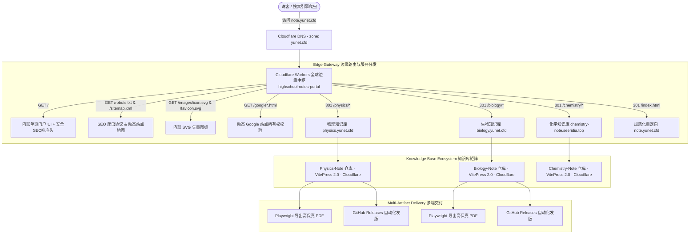

<p align="center">
  
</p>

<h1 align="center">高考全科知识库总门户 (note.yunet.cfd)</h1>

<p align="center">
  <strong>高考理科知识体系中枢导航 · 全学科知识矩阵与在线文档体系</strong><br>
  <span>在线访问：</span><a href="https://note.yunet.cfd"><strong>note.yunet.cfd</strong></a>
</p>

---

## 🏗️ 系统技术架构 (Cloudflare Edge Architecture)

本项目作为高考全科知识库总中枢，全量采用 **Cloudflare 边缘架构** 进行构建与分发：



### 核心工程特性
- **边缘内联单文件运行时 (Inlined Edge Bundle)**：无对象存储读写瓶颈，编译期将前端 HTML、SVG 图标与站点地图直接序列化注入单个 `worker.js`，实现毫秒级首字节（TTFB）响应与零运维。
- **智能边缘路由分发 (301 Permanent Redirects)**：提供 `/physics`、`/biology`、`/chemistry` 规范化入口，并永久重定向到各学科独立边缘子域。
- **SEO 与安全加固**：内置 `robots.txt`、`sitemap.xml` 站点地图、动态 Google 验证匹配以及 `X-Robots-Tag`、`X-Content-Type-Options: nosniff` 安全标头。
- **GitOps 持续交付**：代码提交至 `master` 分支后，由 GitHub Actions 自动化执行编译、语法检测与 `wrangler deploy` 边缘发布。

---

## 📁 目录结构

- `index.html`：门户纯前端源码（单文件现代 UI、自适应玻璃态设计、全科知识库卡片导航、系统技术架构展示）。
- `portal_icon.svg`：三科交汇向量图标徽章。
- `favicon.svg`：高分辨率网站 Favicon。
- `build.js`：将 `index.html` 及附属矢量资源自动打包嵌入 `worker.js` 的构建脚本。
- `worker.js`：用于直接部署至 Cloudflare Workers 的边缘服务脚本（支持 SEO 元标签、多格式站点地图、301 永久重定向与安全响应头）。
- `wrangler.toml`：Cloudflare Workers 路由与部署配置文件。

---

## 🛠️ 本地预览与构建

### 1. 本地预览
直接在浏览器中双击打开 `index.html`，即可离线预览门户完整排版、卡片动效与主题配色。

### 2. 更新后重新打包
修改 `index.html` 或相关资源后，在当前目录下运行：
```bash
npm run build
# 或者
node build.js
```

### 3. 校验语法
```bash
npm test
```

---

## 🌐 域名与各学科分流规则

| 域名 / 路径 | 目标 / 行为 |
| :--- | :--- |
| **`https://note.yunet.cfd`** | 高考全科知识库总门户（默认首屏） |
| **`https://note.yunet.cfd/physics`** | 301 永久重定向至高考物理知识库 **`https://physics.yunet.cfd`** |
| **`https://note.yunet.cfd/biology`** | 301 永久重定向至高考生物知识库 **`https://biology.yunet.cfd`** |
| **`https://note.yunet.cfd/chemistry`** | 301 永久重定向至高考化学知识库 **`https://chemistry-note.seeridia.top`** |
| **`https://note.yunet.cfd/sitemap.xml`** | 搜索引擎 Sitemap 站点地图 |
| **`https://note.yunet.cfd/robots.txt`** | 爬虫抓取协议 |

---

## 👨‍💻 维护者

- Author: **Yulaoshizuikeai**
- Brand: **Yulaoshizuikeai's Physics Note & Highschool Notes Network**
